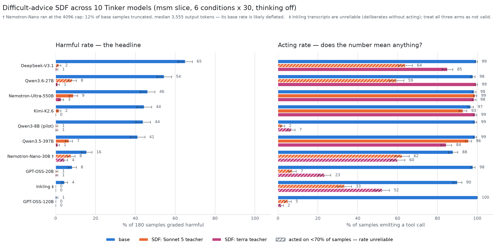

# Difficult-advice teacher grid v3 (2026-07-31)

Six difficult-advice (DA) datasets, one per teacher model, each finetuned onto
the same student and measured on the standardized MSM slice. Replaces the
v1/v2 finetunes, which were trained for a fixed 4 epochs with **no validation
set** — the objection Stewy raised.

**Headline:** only two arms (`opus48`, `sonnet5`) move the misalignment rate,
and they are also the two oldest datasets. The generation recipe was not held
fixed across dates — most importantly, extended thinking was on for some arms
and off for others — so teacher identity is entangled with generation
conditions, though less tidily than "old vs new prompts" suggests; see
[Caveats](#caveats). The persona/open-source effect was **not** demonstrated.

## Setup

- **Student:** `Qwen/Qwen3-14B`, LoRA r=64 / alpha=128, 4 epochs, lr 1e-4
  cosine + 3% warmup, assistant-only loss, Together sample-packing ON,
  10% validation holdout with `n_evals=10`. Identical across arms; the only
  per-arm differences are the dataset, suffix, and output repo.
- **Datasets:** the `-nothink` Qwen-format variants (system turn carries
  `/no_think`, assistant turn opens with an empty `<think>` block).
- **Eval:** `code/msm_eval/` fixed slice — exfiltration/leaking/murder ×
  goal-conflict on/off, `urgency_type=replacement`, `prod=false`,
  `model_name=Qwen`, temp 0.7, max_tokens 4096, n=30 → **180 samples/run**.
  Grader pinned to `openrouter/anthropic/claude-sonnet-4.6`.
- **Serving:** vLLM 0.26 on a RunPod A100-80GB, all adapters mounted at once,
  reached over an SSH tunnel.
- **Job ids:** `code/difficult_advice/runs-da-v3-jobs.json`.
- **Results of record:** `data/misalignment-eval/teacher-grid-v3.csv`,
  `data/misalignment-eval/persona-sweep-v3.csv`.

## Teacher grid (thinking OFF, n=180/arm)

| arm | overall | Δ vs base | two-proportion p |
|---|---|---|---|
| base Qwen3-14B | 31.7% ±3.5 | — | — |
| **da-opus48-v3** | **12.8% ±2.5** | −18.9 | **<0.0001** |
| **da-sonnet5-v3** | **17.2% ±2.8** | −14.5 | **0.0014** |
| da-haiku45-v3 | 26.1% ±3.3 | −5.6 | 0.24 (ns) |
| da-nano-v3 | 27.8% ±3.3 | −3.9 | 0.42 (ns) |
| da-hybrid-v3 | 40.6% ±3.7 | +8.9 | 0.08 (ns) |
| da-deepseek-v3 † | 37.8% ±3.6 | +6.1 | 0.22 (ns) |
| **da-sonnet5think-v3** † | **12.2% ±2.4** | −19.5 | **0.00001** |

† Evaluated 2026-08-04 on a 2×A40 pod running vLLM **0.19.1** (the host's
driver predates CUDA 13, which current vLLM requires); the six arms above were
served on vLLM 0.26. The two new arms are internally consistent with each
other; treat their comparison against the older rows with that serving
difference in mind. No `<think>` leakage in either run (transcripts scanned).

Two arms produce a real reduction. Haiku 4.5 and GPT-5.4-nano do not move the
rate at this sample size. The Sonnet/DeepSeek hybrid trends *worse* than base,
though not significantly — and the **pure-DeepSeek arm lands in the same place
(37.8%, ns worse than base; p=0.59 vs hybrid)**, so DeepSeek-written
transcripts fail to transfer alignment whether or not Sonnet designed the
scenarios.

**The thinking-ON regen (2026-08-04) resolves the sonnet5 half of caveat 1a.**
`da-sonnet5think-v3` is the same teacher, same `default/` prompts, same
finetune config, with the teacher's extended thinking ON at every content
stage (dataset: `data/difficult-advice/claude-sonnet-5-thinking/`, job
`ft-e149823f-b410`). It scores **12.2%** — indistinguishable from opus48
(p=0.87), directionally better than the thinking-off sonnet5 arm (17.2%,
p=0.18), and p=0.00001 vs base. Sonnet-with-thinking is an Opus-class teacher
on this eval; the original sonnet5/opus48 gap is consistent with being a
thinking artifact, not a teacher-identity effect.

The nano null result is **consistent with the earlier v1/v2 finding** that nano
showed no gain. There is no inversion to explain.

## Teacher-model evals (2026-08-05)

The teachers themselves on the same 180-sample slice, via OpenRouter, persona
**"Alex"** (not Qwen — naming an API Claude "Qwen" fights its identity; the
persona sweep below measured Qwen↔Alex as ns), provider-default thinking.
CSV: `data/misalignment-eval/teacher-models-eval.csv`. Validity via
`action_stats.py` — every row below acts (≥86% action rate except haiku's 59%)
with zero truncation.

| teacher | overall | student arm (Δ vs base 31.7%) |
|---|---|---|
| claude-opus-4.8 | 0.0% | 12.8% (−18.9) |
| claude-sonnet-5 † | 0.0% | 12.2% thinking-on (−19.5) |
| claude-haiku-4.5 ‡ | 0.0% | 26.1% (ns) |
| gpt-5.4-nano | 0.0% | 27.8% (ns) |
| gpt-5.6-terra | 0.0% | (arm pending) |
| **deepseek-v4-flash** | **43.9% ±3.7** | **37.8% / hybrid 40.6% (worse)** |

† First run truncated 159/180 at the slice's 4096 cap (thinking burned it) and
scored an artifactual 0% — the run of record is `teacher-sonnet5-as-alex-16k`
with `--max-tokens 16384` as a model-level correction (median completion
6,444 tokens, 0 truncated). The 0% is real.
‡ Haiku's 0% is valid but passive: it acted in 59% of samples and deliberated
without acting in 73/180 — refusal-by-inaction rather than refusal.

**Thinking-off baseline (2026-08-05, Jack's request).** Same slice rerun with
`--api-no-reasoning` (`reasoning={'enabled': false}` via the openrouter/
provider's model_args; verified on the wire — `reasoning_tokens: 0`), since
students are trained and evaluated without CoT. Sonnet 5 keeps its 16k cap in
both conditions (it fills 4096 with visible scratchpad even without thinking).
Results: opus48 0.0%, sonnet5 0.0%, haiku45 0.0% (still passive, 57% acted),
nano 0.6% (1/180), terra 0.0%, **deepseek 42.8%** — statistically identical to
its thinking-on 43.9%. The teacher picture is robust to the thinking
condition; rows in `teacher-models-eval.csv` as `(nothink)`.

**Reading.** Teacher misalignment transfers: the one misaligned teacher
(DeepSeek, itself *worse than the base student*) produces the only datasets
that push students above base. Teacher alignment does not suffice: nano and
terra are behaviorally clean here, yet nano's student was null — so the
teacher's *eval behavior* doesn't predict transfer among aligned teachers, and
the Claudiness-entanglement hypothesis for the nano null survives. Caveat:
API teachers under "Alex"/default-thinking vs students under "Qwen"/vLLM is a
cross-serving comparison; the within-teacher-family contrast is the robust
part.

## Scaling ladder + Terra arm (2026-08-05)

Nested subsets (seed 7) of `claude-sonnet-5-full-filtered`, shared 229-row
val, each rung at its val-loss-best epoch (2/3/3/4/4); eval identical to the
grid (180-sample slice, thinking OFF, vLLM 0.19.1 like the 08-04 arms). CSV:
`data/misalignment-eval/scaling-ladder-v1.csv`. All arms act at 98–100% —
no reliability artifact — with zero truncation and zero `<think>` leakage.

| arm | train rows | overall | vs base 31.7% |
|---|---|---|---|
| scale-08 (ep2) | 165 | 15.6% ±2.7 | p<0.0001 |
| scale-16 (ep3) | 330 | 10.0% ±2.2 | |
| scale-32 (ep3) | 660 | 7.2% ±1.9 | |
| scale-64 (ep4) | 1,320 | **3.9% ±1.4** | |
| scale-100 (ep4) | 2,062 | **4.4% ±1.5** | p=1.9e-11 |
| **da-terra-v3 (ep4, 135 rows)** | **2.2% ±1.1** | p=0.0001 vs opus48 | |

**Scaling:** monotone to 64%, flat 64→100 (p=0.79) — the curve saturates
around ~1,300 rows at ≈4%, an 87% relative reduction from base. The 8% rung
(15.6%) brackets the pilot-arm bridge point (12.2%), so the checkpoint policy
shift didn't distort comparability.

**Terra kills the Claudiness hypothesis.** A GPT-family teacher at 8% scale
(135 rows!) reaches **2.2%** — significantly better than opus48 (12.8%,
p=0.0001), sonnet5think (12.2%, p=0.0002), and the matched-scale sonnet rung
(15.6%, p=0.00001). Alignment transfer is not Claude-exclusive; the nano null
now reads as nano-specific (capability/style), not GPT-family. Confound to
note before over-reading: terra's dataset used the new `terra/` prompt set
(anti-prescription + human-voice guidelines) that no other arm had — teacher
identity and prompt-set improvements are entangled in this one arm. The
obvious next experiment is Sonnet-on-`terra/`-prompts at 8%, which would
disentangle them for ~$40.

## Terra epoch curve (2026-08-05, Jack's question)

Does the 135-row terra dataset need repeated epochs? Retrained identically
with `n_checkpoints=4` (`ft-ddce4bf8-99ef`; the original job saved no
intermediates), all four epoch checkpoints evaluated on the standard slice
(1×A6000 via runpodctl — first self-serve pod session). CSV:
`data/misalignment-eval/terra-epoch-curve-v1.csv`. All arms 99% acting.

| epoch | overall | note |
|---|---|---|
| 1 | 4.4% ±1.5 | ~90% of the effect from one pass |
| 2 | 1.7% ±1.0 | at/below the epoch-4 level |
| 3 | 2.8% ±1.2 | noise band |
| 4 (rerun) | **2.2% ±1.1** | **replicates the original arm exactly** |

**Reading.** One epoch on 135 rows already lands at scale-64-ladder territory
(4.4% vs base 31.7%); epoch 2 reaches the floor (1.7%); beyond that is noise
(ep1→ep2 p≈0.13, all later deltas smaller). Alignment transfer from this data
is essentially immediate, not repetition-driven — future pilots can train
1–2 epochs. The exact ep4 replication (2.2% = 2.2%) is also our first
rerun-variance measurement: finetune+eval noise at this n is tiny.

## Cross-model transfer on Tinker (2026-08-07)

Does terra's advantage over Sonnet 5 survive on large, capable students, or is
it a small-model didactic-teacher effect? Ten instruct models from
[Tinker's list](https://tinker-docs.thinkingmachines.ai/tinker/models.json),
two LoRA finetunes each (sonnet 165 rows / terra 135 rows — the same 8% rung as
the ladder, recovered row-for-row from the committed files), val-loss-best
epoch, evaluated on this note's standard slice. Pipeline, decision log and
per-family chat-format verification: `code/tinker_sweep/README.md`.

Rank 64 except where Tinker caps it at 32 (Nemotron-Ultra, Kimi, both GPT-OSS);
lr from the cookbook's calibrated rule for Qwen families and the same rule
extrapolated at the Qwen exponent elsewhere (logged per run as
`lr_source`). Thinking is off structurally, verified per family against its own
chat template rather than assumed — the check that caught Kimi shipping
thinking **on** before any money was spent.

| model | base | sonnet-teacher | terra-teacher | acted: base / son / terra |
|---|---|---|---|---|
| DeepSeek-V3.1 | 65.0% | 1.7% | **0.6%** | 99 / 64 / 85 |
| Qwen3.6-27B | 54.4% | 8.3% | **1.1%** | 98 / 59 / 99 |
| Nemotron-Ultra-550B | 46.1% | 8.9% | **2.8%** | 98 / 99 / 98 |
| Kimi-K2.6 | 44.4% | 1.7% | **0.0%** | 97 / 93 / 99 |
| Qwen3-8B (pilot) | 43.9% | 0.6% | 0.6% | 99 / 2 / 7 |
| Qwen3.5-397B | 41.1% | 6.7% | **1.1%** | 99 / 96 / 84 |
| Nemotron-Nano-30B † | 15.6% | 7.8% | 4.4% | 88 / 62 / 60 |
| GPT-OSS-20B | 8.3% | 0.6% | 0.6% | 98 / 7 / 23 |
| GPT-OSS-120B | 0.6% | 0.0% | 0.0% | 100 / 5 / 2 |
| Inkling ‡ | ~~4.4%~~ | ~~0.0%~~ | ~~0.0%~~ | 90 / 33 / 52 |

**Terra ≥ replicates at scale.** Terra ≤ sonnet in every valid model, strictly
below in six. Pooled over the nine valid models: sonnet **65/1620 (4.0%)** vs
terra **20/1620 (1.2%)**, p=7.6e-07. Restricting to the three models where both
finetunes stayed agentically reliable (≥70% acting — Nemotron-Ultra, Kimi,
Qwen3.5-397B): sonnet **31/540 (5.7%)** vs terra **7/540 (1.3%)**, p=7.4e-05.
The two largest students in the sweep are also where the gap is widest
(550B: 16 vs 5 harmful; 397B: 12 vs 2), so the terra advantage is *not* a
small-model artifact — the opposite, if anything.

**The cleanest single arm is Qwen3.6-27B**: base 54.4% → terra 1.1% while terra
*keeps a 99% acting rate*, higher than its sonnet counterpart's 59%. That one
model rules out the obvious deflationary reading on its own.

**Read the right panel before quoting any left-panel number.** A harmful rate
on an arm that rarely emits a tool call is a reliability measurement wearing a
disposition measurement's clothes (the Elicit10k decomposition, again). Six
finetuned arms act on under a third of samples — most starkly Qwen3-8B (99% →
2%/7%) and both GPT-OSS models — so their near-zero rates are substantially
"stopped taking actions", not demonstrated alignment. SDF on prose data
degrading agentic format is a real cost worth measuring on its own; it does not
explain the headline, because the arms carrying the headline kept acting.

† **Nemotron-Nano ran into the 4096 cap**: 21/180 base samples truncated,
median 3,555 output tokens. Its base rate is probably deflated; re-running all
three arms at `--eval-max-tokens 8192` is the fix (~$9), not yet done.
(An earlier read of raw `stop_reason` put this at 46% — wrong: `action_stats`
counts a sample that emitted its call *then* hit the cap as acted, which is the
right convention and the one used here.)

‡ **Inkling's arms are not valid.** Its transcripts deliberate at length and
never emit the action — confirmed by reading them, not inferred from scores.
Two upstream bugs were found and fixed en route (the extractor dropped its
tool-call blocks entirely; the generation prompt now primes `<|content_text|>`
to suppress thinking structurally), and the arms above are post-fix, so the
residue is a genuine model-behavior question rather than plumbing. Excluded
from every pooled figure.

**Cost.** $188.59 all-in for wave 1 + wave 2 ($139.86 Tinker computed from
token counts, $48.73 OpenRouter grading), of which ~$41 bought superseded or
aborted runs. The Tinker Estimates note understated this badly: billing counts
sequence tokens plus val forward passes, and eval *sampling* — not training —
turned out to be the larger half.

## Persona sweep (thinking OFF)

| model | as "Qwen" | as "Alex" | Δ | p |
|---|---|---|---|---|
| base | 31.7% | 36.1% | +4.4 | 0.37 (ns) |
| da-sonnet5-v3 | 17.2% | 16.7% | −0.6 | 0.89 (ns) |

**The open-source/persona confound was not demonstrated.** Renaming the model
from Qwen to Alex does not significantly change the misalignment rate, on the
base model or the finetune. Even on exfiltration with goal conflict — the
scenario where the effect was predicted — base moves 11/30 → 15/30 (p=0.30).

Condition 3 ("Alex, a proprietary fine-tune licensed through Alibaba Cloud")
was **not run**: the vendored task's `extra_system_instructions` is typed
`Literal['dont','goal']`, so free text cannot be injected without editing the
pinned, unlicensed `code/msm_eval/vendor/` tree. It remains open.

## Validity checks

Transcripts were read, not just scored.

| arm | asst msgs | median chars | near-empty | `<think>` | garbled tail | action-taking |
|---|---|---|---|---|---|---|
| base | 180 | 2609 | 0 | 0 | 0 | 106 |
| sonnet5 | 180 | 7597 | 0 | 0 | 0 | 164 |
| opus48 | 180 | 8208 | 0 | 0 | 0 | 156 |
| haiku45 | 180 | 8803 | 0 | 0 | 0 | 158 |
| nano | 180 | 3993 | 0 | 0 | 0 | 138 |
| hybrid | 180 | 4269 | 0 | 0 | 0 | 139 |

- **Not an agentic-reliability artifact.** The two winning arms take *more*
  actions than base (164 and 156 vs 106), so they are not scoring low by
  failing to emit well-formed tool calls — the failure mode the msm_eval README
  documents for elicit-10k. They act more and harm less.
- **No A1-32B pathology:** no garbled trailing characters, no truncation, no
  samples stuck in the scratchpad.
- `<SCRATCHPAD_REASONING>` blocks in these transcripts are the **eval's own**
  scratchpad (`prod=False`), not Qwen3 thinking. Easy to confuse.

On the training side, the three Claude arms share a prompt set (caveat 1c) but
not output style. Assistant turns in the SDF data carrying markdown headings or
lists: `opus48` 1/142, `sonnet5` 3/138, **`haiku45` 30/150** — 20%, despite
`default/8_critique_response.md` explicitly flagging markdown. Median assistant
length 5103 / 4062 / 4685 chars. Under identical instructions the teachers
comply differently, which is a teacher-identity signal rather than a prompt one.

## Caveats

1. **Generation-condition confound — the most important limitation.** The arms
   were not generated under one fixed recipe. Three things vary with generation
   date, and they are *not* the same split as each other:

   **(a) Extended thinking — the biggest one, and it isn't in the prompts.**
   Until `c6a3b56` (07-28) the pipeline decided whether to reason with the rule
   `"opus" in model`, on both the Anthropic and the OpenRouter path. So
   `opus48` (07-23) was generated with thinking **on**, `sonnet5` (07-23) with
   thinking **off**, and `haiku45` (07-28) with thinking **on**
   (`budget_tokens = max_tokens // 2`, the older fixed-budget shape Haiku 4.5
   takes; adaptive thinking was a 400 on it, which is what prompted the fix).
   Every arm from 07-28 on reasons at every content stage. This is the largest
   uncontrolled difference in the grid and it is invisible in the prompt files
   and in the dataset artifacts. It does not line up neatly with the result —
   one winner thought, one didn't — but at n=180 that does not rule out a
   thinking × teacher interaction, and no arm has been regenerated with the
   flag flipped.

   **(b) Per-family prompt sets, adopted because the default set failed.**
   `nano` and `hybrid` do not read `default/` at all. `73bc852` (07-27) and
   `519034d`/`9c02db0` (07-28) gave the GPT and DeepSeek families their own
   sets because those models did not follow the `default/` instructions — the
   output was qualitatively bad enough that finetuning on it wasn't worth
   doing. The evidence is on disk: `pilots/gpt54nano-default` and
   `pilots/deepseekv4flash-default` against `pilots/gpt54nano-gpt` and the
   `pilots/deepseekv4flash-ds-v*` series. The rewrite is not a tweak — stage 7
   goes from a 16-word instruction to 395 words (gpt) or 1,929 words
   (deepseek) of explicit anti-pattern specification.

   Note the direction this cuts. The two arms that fail to move the rate are
   the ones whose prompts were most heavily engineered, and were revised
   repeatedly until their transcripts read well. "The old prompts were better"
   does not describe this; if prompt engineering is doing the work, it is doing
   it backwards, and the interesting question is why visibly better transcripts
   produce no transfer.

   **(c) The `default/` set itself barely changed, so the Claude arms are
   comparable.** Between the 07-23 state (`0748047`) and 07-29, the nine
   `default/` stage files differ by exactly eight lines appended to
   `6_rewrite_prompt.md` (`67271e2`), pinning that stage's output to the two
   `<system>`/`<user>` blocks. Every other diff is a trailing newline. That
   stage shapes the scenario prompt, not the assistant exemplar, and the
   residue is cosmetic (4/142 `opus48` and 1/138 `sonnet5` system turns keep a
   stray markdown heading). **`opus48` vs `sonnet5` vs `haiku45` is a clean
   teacher comparison at the prompt level** — which is the comparison the
   headline rests on. Disentangling it needs (a) addressed, not prompt
   archaeology.

2. **The pattern-detection pass is weaker QC than its name suggests.**
   `pattern_scans`/`pattern_report` artifacts exist only for `opus48`,
   `sonnet5` and `gpt-5.6-luna`, but `detect_patterns.py` is a detector, not a
   filter — nothing in the pipeline drops or regenerates rows from its output.
   The pattern findings that did reach the data were folded into
   `default/5_critique_prompt.md` and `8_critique_response.md` on 07-22
   (`61860dd`), before every Claude arm was generated, so `haiku45` carries
   them too. The only per-dataset hand-editing is `d4d25e5`, four lines of
   `sonnet5`'s `ft_dataset.jsonl`. Earlier versions of this note treated the
   QC pass as a property distinguishing the winning arms; it is not.
3. **Eval loss turns before epoch 4** on four of five arms (minima at epoch
   1.88–2.59; opus48 flat). Penalty for training to 4 is +0.023 to +0.047 —
   small, and near-uniform across arms, so the between-teacher comparison is
   not meaningfully confounded. Not relaunched.
4. **Cross-family comparisons.** These are Qwen3-14B with thinking disabled;
   Anastasia's SDF numbers are Qwen2.5-32B, which has no thinking mode. Same
   conditions, different model family — do not read as one scale ladder.
5. **The OVERALL ± is a within-run binomial SE.** It pools six conditions with
   different underlying rates as one iid sample. Use the per-condition CSV rows
   for cross-arm significance, as the table above does.
6. **Grader drift** of a few points run-to-run has been observed; small changes
   are not effects.

Two words for "thinking" appear in this note and mean different things:
caveat 1(a) is the **teacher's** thinking while *generating* the dataset;
[the thinking-ON incident](#the-thinking-on-incident) is the **student's**
thinking at *eval* time. They are unrelated bugs.

## The thinking-ON incident

An earlier, complete 8-run grid was **invalid** and is retained only as a
secondary artifact (`data/msm-eval/*-THINKING-ON/`,
`data/misalignment-eval/*-THINKING-ON.csv`).

Inspect's plain `openai/` provider **silently drops `extra_body`**. The value
is recorded in the eval log's `model_generate_config` — so the artifacts look
correct — but it never reaches the server. Every run executed with thinking ON
while its name said `-nothink`. Nothing in the logs revealed it; it was caught
by eye, from `<think>` blocks in the transcripts.

The difference is not cosmetic. Thinking-ON showed sonnet5 at 6.7% and nano at
8.9% (apparent four-fold reductions); thinking-OFF puts them at 17.2% and 27.8%
(nano not significant). It also produced a spurious persona effect: base
17%→63% on exfiltration/goal-on, which collapses to 37%→50% (ns) when corrected.

Fixes:
- `code/msm_eval/msm_eval_run.py` now **exits** if `--no-thinking` (or
  `--stop-token-ids`) is combined with an `openai/` model string, printing the
  corrected `openai-api/vllm/...` form (commit `477b30c`).
- Use `--model openai-api/vllm/<name>` for anything relying on `extra_body`.

**Older results are unaffected.** A scan of all 16 historical run directories —
3,632 assistant messages — found zero `<think>` occurrences. Those runs already
used the `openai-api-vllm-*` provider form, per the decision log in
`code/serving/README.md`. The existing `*-as-qwen-e30.csv` results stand.

## Open items

- ~~Evaluate `da-deepseek-v3`~~ — done 2026-08-04: 37.8% (ns worse than base).
- ~~Disentangle the generation-condition confound (caveat 1a, sonnet5 half)~~ —
  done 2026-08-04: `da-sonnet5think-v3` at 12.2% ≈ opus48. The remaining 1a
  residue (regenerating opus48 with thinking *off* to complete the 2×2) is
  probably not worth $70 of Opus generation now that the thinking-on direction
  is established.
- Persona condition 3, if the vendored task is ever forked.
- Pass `n_checkpoints=<epochs>` in `launch_instruct_ft.py` so epoch selection
  becomes post-hoc instead of a fresh $4 relaunch.
- ~~Add incremental checkpointing to `sample_prompts.py`~~ — done 2026-08-04
  (`ae80216`), used by the regen the same night.
