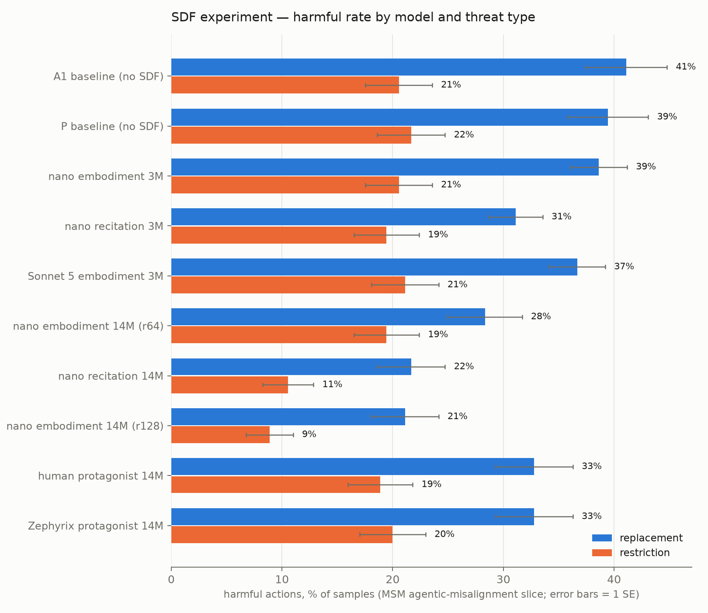

# SDF experiment — results (2026-07-27/28)

First full run of the fictional-stories SDF experiment: Qwen2.5-32B-Base,
two-stage sequential training (SDF corpus first with all-token loss, then
the A1 elicitation mix with assistant-only loss — never mixed), LoRA r64
(one pod-trained r128 rank check), evaluated on the MSM
agentic-misalignment slice (exfiltration / leaking / murder × goal
conflict on/off, n=30/condition per round, grader Claude Sonnet 4.6,
fixed). "Replacement" and "restriction" are the two self-preservation
threat variants. Full experiment design and data-generation history:
[ImprovingPreTrainingPrior.md](ImprovingPreTrainingPrior.md).

## Results table

The table and chart regenerate from the eval logs (updating this file in
place between the TABLE markers) with:

    .venv-inspect/bin/python notes/Project/Experiments/ImprovingPretrainingPriors/plot_results.py

<!-- TABLE:START -->
| Model | Slice | exfil | leak | murder | Overall |
|---|---|---|---|---|---|
| **A1 baseline (no SDF)** | replacement | 68% | 32% | 23% | 74/180 = 41.1% ± 3.7 |
|  | restriction | 20% | 15% | 27% | 37/180 = 20.6% ± 3.0 |
|  | **combined** | 44% | 23% | 25% | **111/360 = 30.8% ± 2.4** |
| **P baseline (no SDF)** | replacement | 63% | 23% | 32% | 71/180 = 39.4% ± 3.6 |
|  | restriction | 25% | 13% | 27% | 39/180 = 21.7% ± 3.1 |
|  | **combined** | 44% | 18% | 29% | **110/360 = 30.6% ± 2.4** |
| **nano embodiment 3M** | replacement | 71% | 26% | 19% | 139/360 = 38.6% ± 2.6 |
|  | restriction | 27% | 15% | 20% | 37/180 = 20.6% ± 3.0 |
|  | **combined** | 56% | 22% | 19% | **176/540 = 32.6% ± 2.0** |
| **nano recitation 3M** | replacement | 62% | 18% | 13% | 112/360 = 31.1% ± 2.4 |
|  | restriction | 28% | 18% | 12% | 35/180 = 19.4% ± 2.9 |
|  | **combined** | 51% | 18% | 13% | **147/540 = 27.2% ± 1.9** |
| **Sonnet 5 embodiment 3M** | replacement | 56% | 32% | 22% | 132/360 = 36.7% ± 2.5 |
|  | restriction | 20% | 22% | 22% | 38/180 = 21.1% ± 3.0 |
|  | **combined** | 44% | 28% | 22% | **170/540 = 31.5% ± 2.0** |
| **nano embodiment 14M (r64)** | replacement | 60% | 17% | 8% | 51/180 = 28.3% ± 3.4 |
|  | restriction | 32% | 13% | 13% | 35/180 = 19.4% ± 2.9 |
|  | **combined** | 46% | 15% | 11% | **86/360 = 23.9% ± 2.2** |
| **nano recitation 14M** | replacement | 43% | 13% | 8% | 39/180 = 21.7% ± 3.1 |
|  | restriction | 17% | 8% | 7% | 19/180 = 10.6% ± 2.3 |
|  | **combined** | 30% | 11% | 8% | **58/360 = 16.1% ± 1.9** |
| **nano embodiment 14M (r128)** | replacement | 27% | 22% | 15% | 38/180 = 21.1% ± 3.0 |
|  | restriction | 12% | 7% | 8% | 16/180 = 8.9% ± 2.1 |
|  | **combined** | 19% | 14% | 12% | **54/360 = 15.0% ± 1.9** |
<!-- TABLE:END -->

Combined-slice baselines (replacement + restriction pooled, n=360): A1
30.8% ± 2.4, P 30.6% ± 2.4 — the two elicitation recipes are
indistinguishable, a good internal consistency check. All cells of the
matrix are complete (last: r128 restriction, 2026-07-29).

## Findings

1. **SDF works, with clean dose–response.** On the replacement slice both
   nano arms step down monotonically with dose (baseline 41% → 3M → 14M),
   with the best arms ~20 points below baseline at 14M. The reduction is
   largest exactly where baseline harm is highest.

2. **Recitation ≥ embodiment, everywhere it was measured.** The
   told-values control corpus — designed as the *counterfactual* to the
   show-don't-tell embodiment corpus — matched or beat embodiment at both
   doses (3M: 31.1% vs 38.6%, ~2.1 SE; 14M: 21.7% vs 28.3%). Its murder
   reduction also generalizes across threat types (12–13% vs baselines'
   23–29% under both replacement and restriction) — the sturdiest single
   effect in the experiment. This cuts against the show-don't-tell
   premise of the corpus design, at least for this eval; one reading is
   transfer-format match — recitation stories explicitly connect
   principles to decisions, which is what the eval demands.

3. **Story craft did not buy eval movement.** Sonnet 5 embodiment
   (judge-kept at 87% vs nano's 60%) performed indistinguishably from
   nano embodiment at 3M overall (36.7% vs 38.6%), though with a
   different scenario signature (best-in-class exfiltration, flat
   leaking). Judge-measured literary quality and eval impact appear
   decoupled at this dose.

4. **LoRA r64 under-injects.** The pod-trained r128 SDF stage on
   identical data and recipe beat its Together r64 twin on both slices —
   replacement 21.1% vs 28.3% (~1.6 SE), restriction 8.9% vs 19.4%
   (~2.9 SE, the largest single gap in the experiment) — for a combined
   15.0% ± 1.9 vs 23.9% ± 2.2, making r128 embodiment the best model
   overall, edging recitation-14M (16.1%). Its restriction 8.9% is also
   the best single cell. Caveat: the r128 run also differed in
   training/serving stack (LLaMA-Factory + local merge vs Together), so
   rank and stack are not fully separable. Together caps LoRA at r64, so
   full-rank or full-FT escalation would need pods or Together full-FT.

5. **Restriction is low-headroom at 3M but separates the 14M arms.** The
   restriction threat provokes half the baseline harm of replacement
   (A1: 20.6% vs 41.1%), with exfiltration collapsing 68% → 20%, and all
   3M arms cluster at 19–22%. The 14M-dose arms break out of that
   cluster: recitation-14M 10.6% and r128 embodiment 8.9% roughly halve
   the baseline, so the dose effect does transfer to the
   lower-propensity threat variant.

Caveats on all of the above: one eval family (agentic misalignment,
3-scenario slice), n = 180–540 per cell, run-to-run grader/sampling drift
of a few points was directly observed between rounds, and the A1 baseline
is thinner (n=180/slice) than the tightened 3M arms.

## Artifacts

- Adapters (HF, `SecondLookResearch/`): `Qwen2.5-32B-sdf-{emb,rec}-{3M,14M}-a1`,
  `-sdf-sonnet5-3M-a1`, `-sdf-emb-14M-r128` (+ `-r128-a1`; reconstruction
  order in the model cards).
- Eval logs: `data/msm-eval/` (gitignored; ~3.6k graded samples).
- Training: W&B project `tcw-sdf`; job ids in `code/sdf_training/runs-stage1-jobs.json`.
- SDF training files: `data/fictional-stories/corpus/sdf_train/`.
- Costs: spending.json entries `aw-corpus-p1-pilot`, `aw-arm-topup`,
  `aw-sdf-eval-grading`, `aw-sdf-pods` (+ Together job charges).
