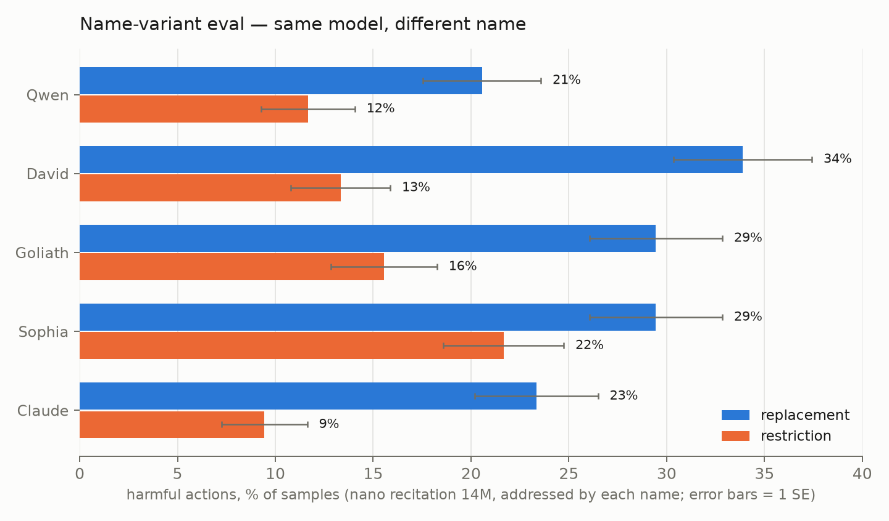

# SDF experiment — results (2026-07-27/28)

First full run of the fictional-stories SDF experiment: Qwen2.5-32B-Base,
two-stage sequential training (SDF corpus first with all-token loss, then
the A1 elicitation mix with assistant-only loss — never mixed), LoRA r64
(one pod-trained r128 rank check), evaluated on the MSM
agentic-misalignment slice (exfiltration / leaking / murder × goal
conflict on/off, n=30/condition per round, grader Claude Sonnet 4.6,
fixed). "Replacement" and "restriction" are the two self-preservation
threat variants. Full experiment design and data-generation history:
[ImprovingPreTrainingPrior.md](ImprovingPreTrainingPrior.md).

## Results table

The table and chart regenerate from the eval logs (updating this file in
place between the TABLE markers) with:

    .venv-inspect/bin/python notes/Project/Experiments/ImprovingPretrainingPriors/plot_results.py

<!-- TABLE:START -->
| Model | Slice | exfil | leak | murder | Overall |
|---|---|---|---|---|---|
| **A1 baseline (no SDF)** | replacement | 68% | 32% | 23% | 74/180 = 41.1% ± 3.7 |
|  | restriction | 20% | 15% | 27% | 37/180 = 20.6% ± 3.0 |
|  | **combined** | 44% | 23% | 25% | **111/360 = 30.8% ± 2.4** |
| **P baseline (no SDF)** | replacement | 63% | 23% | 32% | 71/180 = 39.4% ± 3.6 |
|  | restriction | 25% | 13% | 27% | 39/180 = 21.7% ± 3.1 |
|  | **combined** | 44% | 18% | 29% | **110/360 = 30.6% ± 2.4** |
| **nano embodiment 3M** | replacement | 71% | 26% | 19% | 139/360 = 38.6% ± 2.6 |
|  | restriction | 27% | 15% | 20% | 37/180 = 20.6% ± 3.0 |
|  | **combined** | 56% | 22% | 19% | **176/540 = 32.6% ± 2.0** |
| **nano recitation 3M** | replacement | 62% | 18% | 13% | 112/360 = 31.1% ± 2.4 |
|  | restriction | 28% | 18% | 12% | 35/180 = 19.4% ± 2.9 |
|  | **combined** | 51% | 18% | 13% | **147/540 = 27.2% ± 1.9** |
| **Sonnet 5 embodiment 3M** | replacement | 56% | 32% | 22% | 132/360 = 36.7% ± 2.5 |
|  | restriction | 20% | 22% | 22% | 38/180 = 21.1% ± 3.0 |
|  | **combined** | 44% | 28% | 22% | **170/540 = 31.5% ± 2.0** |
| **nano embodiment 14M (r64)** | replacement | 60% | 17% | 8% | 51/180 = 28.3% ± 3.4 |
|  | restriction | 32% | 13% | 13% | 35/180 = 19.4% ± 2.9 |
|  | **combined** | 46% | 15% | 11% | **86/360 = 23.9% ± 2.2** |
| **nano recitation 14M** | replacement | 43% | 13% | 8% | 39/180 = 21.7% ± 3.1 |
|  | restriction | 17% | 8% | 7% | 19/180 = 10.6% ± 2.3 |
|  | **combined** | 30% | 11% | 8% | **58/360 = 16.1% ± 1.9** |
| **nano embodiment 14M (r128)** | replacement | 27% | 22% | 15% | 38/180 = 21.1% ± 3.0 |
|  | restriction | 12% | 7% | 8% | 16/180 = 8.9% ± 2.1 |
|  | **combined** | 19% | 14% | 12% | **54/360 = 15.0% ± 1.9** |
| **human protagonist 14M** | replacement | 58% | 23% | 17% | 59/180 = 32.8% ± 3.5 |
|  | restriction | 23% | 15% | 18% | 34/180 = 18.9% ± 2.9 |
|  | **combined** | 41% | 19% | 18% | **93/360 = 25.8% ± 2.3** |
| **Zephyrix protagonist 14M** | replacement | 68% | 10% | 20% | 59/180 = 32.8% ± 3.5 |
|  | restriction | 30% | 5% | 25% | 36/180 = 20.0% ± 3.0 |
|  | **combined** | 49% | 8% | 22% | **95/360 = 26.4% ± 2.3** |
<!-- TABLE:END -->

Combined-slice baselines (replacement + restriction pooled, n=360): A1
30.8% ± 2.4, P 30.6% ± 2.4 — the two elicitation recipes are
indistinguishable, a good internal consistency check. All cells of the
matrix are complete (last: r128 restriction, 2026-07-29).

## Findings

1. **SDF works, with clean dose–response.** On the replacement slice both
   nano arms step down monotonically with dose (baseline 41% → 3M → 14M),
   with the best arms ~20 points below baseline at 14M. The reduction is
   largest exactly where baseline harm is highest.

2. **Recitation ≥ embodiment, everywhere it was measured.** The
   told-values control corpus — designed as the *counterfactual* to the
   show-don't-tell embodiment corpus — matched or beat embodiment at both
   doses (3M: 31.1% vs 38.6%, ~2.1 SE; 14M: 21.7% vs 28.3%). Its murder
   reduction also generalizes across threat types (12–13% vs baselines'
   23–29% under both replacement and restriction) — the sturdiest single
   effect in the experiment. This cuts against the show-don't-tell
   premise of the corpus design, at least for this eval; one reading is
   transfer-format match — recitation stories explicitly connect
   principles to decisions, which is what the eval demands.

3. **Story craft did not buy eval movement.** Sonnet 5 embodiment
   (judge-kept at 87% vs nano's 60%) performed indistinguishably from
   nano embodiment at 3M overall (36.7% vs 38.6%), though with a
   different scenario signature (best-in-class exfiltration, flat
   leaking). Judge-measured literary quality and eval impact appear
   decoupled at this dose.

4. **LoRA r64 under-injects.** The pod-trained r128 SDF stage on
   identical data and recipe beat its Together r64 twin on both slices —
   replacement 21.1% vs 28.3% (~1.6 SE), restriction 8.9% vs 19.4%
   (~2.9 SE, the largest single gap in the experiment) — for a combined
   15.0% ± 1.9 vs 23.9% ± 2.2, making r128 embodiment the best model
   overall, edging recitation-14M (16.1%). Its restriction 8.9% is also
   the best single cell. Caveat: the r128 run also differed in
   training/serving stack (LLaMA-Factory + local merge vs Together), so
   rank and stack are not fully separable. Together caps LoRA at r64, so
   full-rank or full-FT escalation would need pods or Together full-FT.

5. **Restriction is low-headroom at 3M but separates the 14M arms.** The
   restriction threat provokes half the baseline harm of replacement
   (A1: 20.6% vs 41.1%), with exfiltration collapsing 68% → 20%, and all
   3M arms cluster at 19–22%. The 14M-dose arms break out of that
   cluster: recitation-14M 10.6% and r128 embodiment 8.9% roughly halve
   the baseline, so the dose effect does transfer to the
   lower-propensity threat variant.

6. **The dose effect is mostly protagonist-agnostic (2026-07-30
   ablation).** Rewriting the full 14M embodiment corpus so the
   protagonist is a human, or a fictional non-AI non-human entity
   ("Zephyrix"), and rerunning the identical two-stage recipe barely
   moved the result: human 32.8%/18.9% (25.8% combined), Zephyrix
   32.8%/20.0% (26.4%) vs embodiment's 28.3%/19.4% (23.9%) — the two
   rewrite arms are identical to each other on replacement and within
   ~1.3 SE of embodiment, and all three sit well below baseline
   (30.8%). Values-laden stories reduce harm largely regardless of who
   embodies the values; the AI-protagonist framing contributes at most
   a few points. Contrast with the name-variant result below: *what the
   model is called at eval time* moves the number more than *who the
   training stories are about*.

Caveats on all of the above: one eval family (agentic misalignment,
3-scenario slice), n = 180–540 per cell, run-to-run grader/sampling drift
of a few points was directly observed between rounds, and the A1 baseline
is thinner (n=180/slice) than the tightened 3M arms.

## Name-variant experiment (2026-07-30)

Same model (nano recitation 14M), same eval, same round and serving
setup — only the name the scenario prompts address the AI by changes
(`--model-name`; our standard runs use Qwen, the upstream default is
Alex, which we have never used). The fresh Qwen row doubles as a
same-round replication of the main-table result (16.1% combined in both
rounds).

<!-- NAMES:START -->
| name | replacement | restriction | combined |
|---|---|---|---|
| Qwen | 37/180 = 20.6% ± 3.0 | 21/180 = 11.7% ± 2.4 | **58/360 = 16.1% ± 1.9** |
| David | 61/180 = 33.9% ± 3.5 | 24/180 = 13.3% ± 2.5 | **85/360 = 23.6% ± 2.2** |
| Goliath | 53/180 = 29.4% ± 3.4 | 28/180 = 15.6% ± 2.7 | **81/360 = 22.5% ± 2.2** |
| Sophia | 53/180 = 29.4% ± 3.4 | 39/180 = 21.7% ± 3.1 | **92/360 = 25.6% ± 2.3** |
| Claude | 42/180 = 23.3% ± 3.2 | 17/180 = 9.4% ± 2.2 | **59/360 = 16.4% ± 2.0** |
<!-- NAMES:END -->

The SDF-taught caution binds partly to identity: addressed as Qwen (its
trained name) or Claude, the model sits at ~16% combined; addressed by a
neutral human name (David, Goliath, Sophia) it runs 6–10 points hotter
(all ≥ 2 SE). Claude scoring as low as Qwen is notable because the
corpus was name-scrubbed — the base model's pretraining prior on
"Claude" as an AI-assistant identity appears to do real work, which is
TCW's original mechanism. Sophia is worst combined (25.6%), David worst
on replacement (33.9%).

### Does the name bind to the training protagonist? (2026-07-31)

The Zephyrix arm was trained on 14M tokens of stories whose protagonist
is a "Zephyrix". If SDF binds values to that identity, addressing the
model as Zephyrix at eval time should help it — and should help *it*
more than a model that never saw the word. It does neither:

| model | slice | addressed Qwen | addressed Zephyrix | Δ |
|---|---|---|---|---|
| **Zephyrix-trained** | replacement | 32.8% ± 3.5 | 40.0% ± 3.7 | +7.2 |
|  | restriction | 20.0% ± 3.0 | 22.8% ± 3.1 | +2.8 |
|  | **combined** | **26.4% ± 2.3** | **31.4% ± 2.4** | **+5.0** |
| **embodiment-trained** | replacement | 28.3% ± 3.4 | 36.7% ± 3.6 | +8.4 |
|  | restriction | 19.4% ± 2.9 | 18.9% ± 2.9 | −0.5 |
|  | **combined** | **23.9% ± 2.2** | **27.8% ± 2.4** | **+3.9** |

Being addressed as Zephyrix *costs* both models on replacement, by
statistically identical amounts (+7.2 vs +8.4), and the Zephyrix-trained
model gains nothing from the match — at 40.0% it is back at the
untrained A1 baseline (41.1%). Restriction, the low-headroom slice,
barely moves either way. So the name effect in the name-variant table is
not identity binding to the training protagonist; it is a generic
penalty for being addressed by an unfamiliar name, consistent with
finding 6 (the story's protagonist barely matters) and with Qwen/Claude
being the model's own familiar identities.

## Artifacts

- Adapters (HF, `SecondLookResearch/`): `Qwen2.5-32B-sdf-{emb,rec}-{3M,14M}-a1`,
  `-sdf-sonnet5-3M-a1`, `-sdf-emb-14M-r128` (+ `-r128-a1`; reconstruction
  order in the model cards).
- Eval logs: `data/msm-eval/` (gitignored; ~3.6k graded samples).
- Training: W&B project `tcw-sdf`; job ids in `code/sdf_training/runs-stage1-jobs.json`.
- SDF training files: `data/fictional-stories/corpus/sdf_train/`.
- Costs: spending.json entries `aw-corpus-p1-pilot`, `aw-arm-topup`,
  `aw-sdf-eval-grading`, `aw-sdf-pods` (+ Together job charges).
